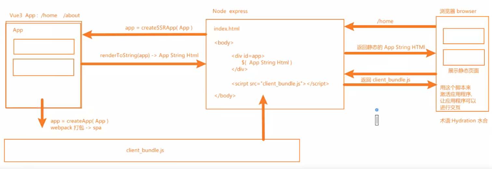
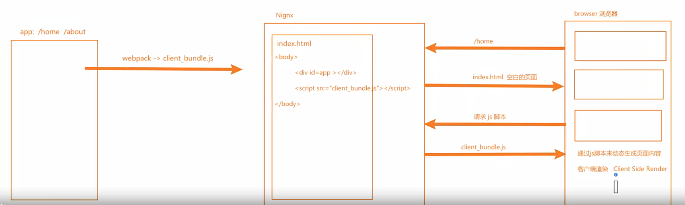

# SEO优化

- 语义性的HTML标记
  - 标题使用h1，一个页面只有一个，副标题用h2到h6
  - 不要过度使用h标签，多次使用不会增加SEO
  - 段落使用p，列表使用ul
- 每个页面需包含：标题+内部链接
  - 每个页面对应的title，同一网站所有页面都有内链可以指向首页
- 确保链接可供抓取
- meta标签优化：设置description，keywords等
- 文本标记和img
  - 使用b，strong标签加粗文本，爬虫也会关注到该内容
  - img标签添加alt属性，图片加载失败，爬虫会取alt内容
- sitemap.xml站点地图：在站点地图列出所有网页，确保爬虫不会漏掉某些网页

## 静态站点生成（SSG）

- SSG一般在构建阶段就确定了网站的内容
- 优点：
  - 访问速度快
  - 直接给浏览器返回静态的HTML，有利于SEO
  - SSG依然保留了SPA的特性，前端路由，响应式数据，虚拟DOM等
- 缺点：
  - 页面都是静态
  - 如果站点内容更新了，必须重新再次构建和部署

## 服务端渲染（SSR）

- SSR工作原理：先返回给浏览器一个静态的HTML页面，然后通过水和Hydration从服务端加载script

  

- 优点：
  - 更快的首屏渲染速度
  - 更好的SEO
- 缺点：
  - 需要对服务器更多的API调用，消耗更多的资源，成本高
  - 增加了开发成本
  - 配置站点缓存相对复杂一点

 ## 客户端渲染 CSR

